### Hi there 👋

<!--
**guogenglin/guogenglin** is a ✨ _special_ ✨ repository because its `README.md` (this file) appears on your GitHub profile.
-->

🔭 Hi, I’m Genglin Guo, PhD, trained in veterinary microbiology, with research interests spanning diverse areas of microbiology. 🌱 I am, and have always been, a learner in bioinformatics. I’m passionate about applying bioinformatics to advance microbiology research and hope to contribute meaningful insights to the field.

💬 I’ve uploaded some scripts that I hope will be helpful to others working in this area. 🤔While they are still evolving, I’m continuously working on refining them through further study, and I would be extremely grateful for any advice or feedback.😄

👯 If you’re working on bacterial genomics and need help with bioinformatics scripts, I’d be glad to collaborate or explore solutions together. ⚡

By the way, I’m currently looking for a job or a postdoctoral position. If you’re interested or have any information, please feel free to contact me as soon as possible. 🙏

📫2019207025@njau.edu.cn; gg599@drexel.edu

  
  

